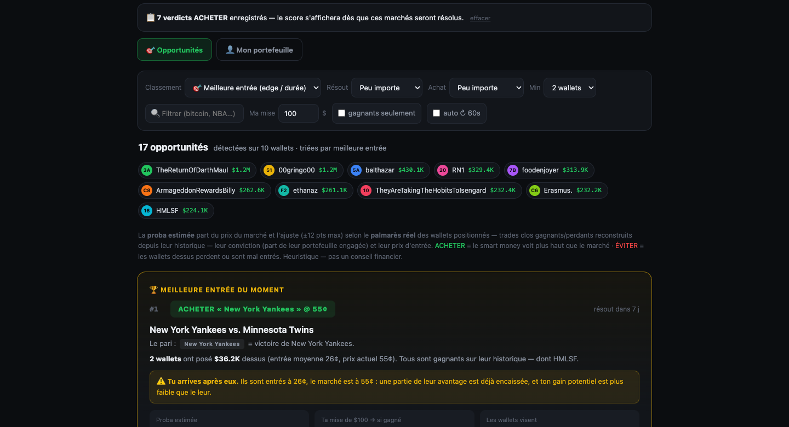

# Polymarket Overlap — Smart Money Tracker

A Polymarket wallet overlap analyzer: paste 0x addresses (or load the top traders), and the tool cross-references their positions **live** and ranks markets by best entry, with a BUY / FOLLOW / AVOID verdict (ACHETER / SUIVRE / ÉVITER in the French interface), estimated vs. market probability, and a stake simulator.

**Live: https://sacha9214.github.io/polymarket-overlap/**

## Features

- **Presets**: this week's top 50 or the all-time top 50, loaded from the Polymarket leaderboard
- **Overlap**: a market surfaces when at least two wallets hold the same outcome
- **Estimated probability**: starts from the market price and adjusts it by at most ±12 points based on the wallets' real track record (reconstructed closed trades), their conviction and their entry price
- **Per-market verdict**: BUY, FOLLOW or AVOID, with a one-line explanation and a per-wallet breakdown
- **Filters and sorting**: best entry, potential gain, probability of winning, resolution date, profitable wallets only
- **Stake simulator**, auto-refresh every 60 s, last search restored

A single HTML file with zero dependencies. Data from `data-api.polymarket.com` and `gamma-api.polymarket.com`. The interface is in French. Not financial advice.

## License

[MIT](LICENSE)
